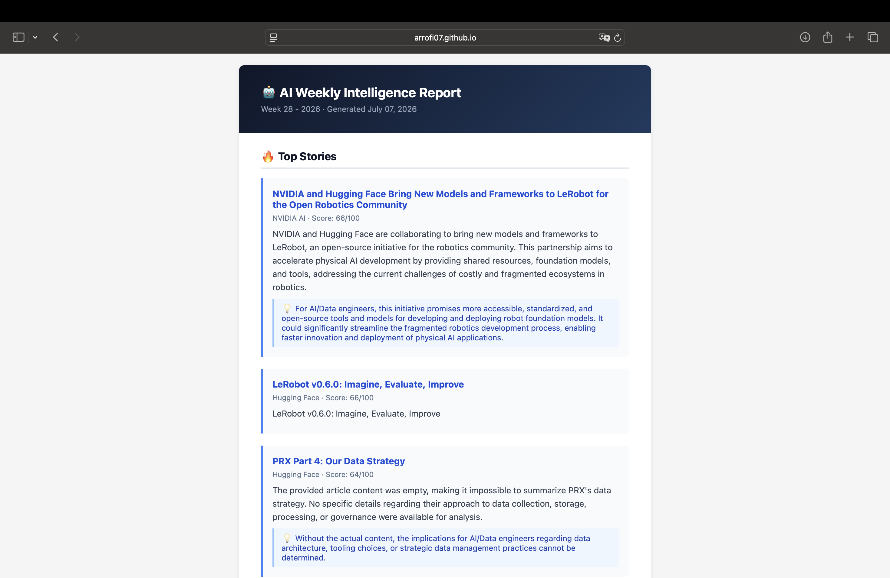

# 🤖 AI Weekly Intelligence Report

[](https://github.com/Arrofi07/ai-news-agent/actions/workflows/weekly.yml)
[](tests/)
[](https://www.python.org)
[](#license)

> **An automated AI intelligence pipeline that answers one question every Monday morning:**
> *"What happened this week that will make me a better AI/Data Engineer?"*

**Live newsletter →** [arrofi07.github.io/ai-news-agent](https://arrofi07.github.io/ai-news-agent)
&nbsp;·&nbsp;
**Archive →** [arrofi07.github.io/ai-news-agent/archive.html](https://arrofi07.github.io/ai-news-agent/archive.html)



---

## Table of Contents

- [Overview](#overview)
- [Architecture](#architecture)
- [Tech Stack](#tech-stack)
- [Pipeline Details](#pipeline-details)
- [Project Structure](#project-structure)
- [Setup & Installation](#setup--installation)
- [Common Commands](#common-commands)
- [CI/CD](#cicd)
- [Deployment](#deployment)
- [Configuration Reference](#configuration-reference)
- [Design Decisions](#design-decisions)
- [Roadmap](#roadmap)

---

## Overview

This is not a news scraper. It's a multi-stage data pipeline that collects from
7+ sources, filters noise through deduplication and importance ranking,
summarizes with an LLM, and delivers a formatted newsletter — fully automated,
every Monday, at zero cost.

- **Collects** ~125 items/week across RSS, arXiv, and GitHub Trending
- **Filters** down to ~17 articles via dedup + a 0–100 composite importance score
- **Summarizes** with Gemini, falling back to Groq if Gemini is rate-limited,
  falling back further to rule-based summaries if both are unavailable —
  the pipeline always produces output
- **Never repeats a story** — once an article ships in a newsletter it's
  permanently excluded from future selection, regardless of how high it
  still scores
- **Publishes** a validated Markdown + HTML newsletter to GitHub Pages every run

## Architecture

```
Every Monday 08:00 UTC
        │
        ▼
┌───────────────────┐
│    COLLECTION     │  RSS · arXiv API · GitHub Trending scraper
│   ~125 articles   │  Age-filtered · Retry with backoff · Per-source failure isolation
└────────┬──────────┘
         │
         ▼
┌───────────────────┐
│    PROCESSING     │  HTML cleaning · Jaccard deduplication · Keyword classification
│    ~17 articles   │  Importance ranking 0–100 · Cross-section exclusion
└────────┬──────────┘
         │
         ▼
┌────────────────────────────────────────────────┐
│              SUMMARIZATION (Phase 4)            │
│                                                  │
│   Gemini 2.5 Flash ──(rate limited 2x)──┐       │
│     │ success                           ▼       │
│     │                              Groq gpt-oss-120b ──(fails 2x)──┐
│     ▼                                   │ success                 ▼
│  structured JSON summary  ◄─────────────┘              rule-based summary
│  (JSON mode enforced at the API level on both providers)          │
└────────┬─────────────────────────────────────────────────────────┘
         │  same provider that survived Phase 4 also writes the newsletter
         ▼
┌──────────────────────────────────────┐
│         NEWSLETTER (Phase 5)         │
│                                      │
│  LLM-written prose ──validation──┐   │
│    (length, no mid-sentence cut, │   │
│     every article URL present)   │   │
│                          fail ───┼──►│  Template fallback
│                          pass ───┘   │  (built from structured data,
│                                      │   can't drop or hallucinate)
└──────────┬───────────────────────────┘
           │
           ├──────────────────────────────────┐
           ▼                                  ▼
┌───────────────────┐            ┌──────────────────────┐
│  GITHUB PAGES     │            │    EMAIL DELIVERY     │
│  Public URL       │            │    Resend API          │
│  Auto-updated     │            │    HTML + plain text   │
└───────────────────┘            └──────────────────────┘
```

---

## Tech Stack

| Layer | Technology | Reason |
|---|---|---|
| Language | Python 3.12 | Best AI/data ecosystem |
| Package manager | uv | Fast, modern, reproducible |
| Database | SQLite (stdlib) | Zero config, perfect for this volume |
| LLM (primary) | Gemini 2.5 Flash | Fast, cheap, strong summarization |
| LLM (fallback) | Groq — `openai/gpt-oss-120b` | Same-run fallback when Gemini is rate-limited; OpenAI-compatible API, generous free tier |
| Automation | GitHub Actions | Free, auditable, no server needed |
| Hosting | GitHub Pages | Free, automatic deploy on every run |
| Email | Resend API | Clean REST API, generous free tier |
| Testing | pytest + unittest.mock | 121 tests, fully offline |

---

## Pipeline Details

### Phase 1+2 — Collection

Three collectors run in sequence. Each is independently fault-tolerant — a single source going down does not affect the others.

| Collector | Source | Method |
|---|---|---|
| `collector/rss.py` | OpenAI, Anthropic, DeepMind, Hugging Face, NVIDIA | feedparser + stdlib XML fallback |
| `collector/arxiv.py` | cs.CL, cs.AI, cs.LG, cs.MA | arXiv public Atom API (no key required) |
| `collector/github.py` | Python + Jupyter repos | GitHub Trending HTML scraper |

Key design decisions:
- **Age filter** — RSS articles older than 7 days are skipped, preventing ingestion of full feed archives
- **URL-based deduplication** — same URL across multiple runs updates in place, never creates duplicate rows
- **Retry with backoff** — up to 3 attempts per source with exponential backoff
- **`collection_runs` table** — every run is recorded with found/new counts and status for observability

### Phase 3 — Processing

Four sequential steps on the raw collected data:

**Cleaner** (`processing/cleaner.py`)
Strips HTML tags, decodes entities, removes UTM tracking parameters, eliminates boilerplate phrases ("Read more", "Subscribe", "Click here"), normalizes Unicode punctuation.

**Deduplicator** (`processing/deduplicate.py`)
Groups near-identical stories using Jaccard similarity on title token sets. Union-Find algorithm for transitive grouping. Canonical article is chosen by source quality rank — primary sources (OpenAI, Anthropic) beat secondary coverage. Duplicates are marked `importance = -1` and excluded from downstream steps.

**Classifier** (`processing/classifier.py`)
Keyword-based topic assignment across 10 categories: `llm`, `agents`, `rag`, `data_engineering`, `mlops`, `open_source`, `research`, `safety`, `company`, `python`. Priority ordering resolves multi-category matches. Articles can hold multiple tags.

**Ranker** (`processing/ranking.py`)
Composite 0–100 importance score:

```
Score = source_quality (0–30)
      + freshness      (0–25, linear decay over 7 days)
      + content_signal (0–25, stars/keywords/abstract length)
      + source_type    (0–20, company announcement > research > trending)
```

Section selection (`llm/summarize.py`) also enforces **cross-section exclusion**: an article selected for `top_stories` or `research` can't also be selected for `tools`, even if it matches both queries (a real bug we hit — an arXiv paper tagged `open_source`/`python` was being summarized twice).

### Phase 4 — LLM Summarization

Each selected article is sent to the active provider with a structured prompt requesting JSON output:

```json
{
  "summary": "2-3 sentence plain-English summary",
  "why_it_matters": "significance for AI/Data engineers",
  "career_impact": "high | medium | low",
  "category": "llm | agents | rag | ...",
  "tags": ["tag1", "tag2"],
  "estimated_read_minutes": 3
}
```

**Provider chain with circuit breaker** (`llm/router.py`): Gemini is tried first. After 2 consecutive failures (rate limit, timeout, truncation), the chain switches to Groq for the *rest of that run* — not per-article — so the article that tripped the breaker is immediately retried on the new provider rather than left with a rule-based summary. If Groq also fails twice in a row, the chain exhausts to rule-based for whatever's left. Whichever provider survives Phase 4 also writes Phase 5's newsletter prose, so one run never mixes two providers' voices in the final output.

**JSON mode, not just lenient parsing** (`llm/gemini.py`, `llm/groq_client.py`): both providers are asked to guarantee valid JSON at the API level (`responseMimeType: application/json` for Gemini, `response_format: {"type": "json_object"}` for Groq) rather than relying on parsing best-effort free text. This is what actually fixed malformed-JSON failures in production — parser leniency (`llm/common.py`'s `strict=False`) is kept as a secondary safety net, but structurally broken JSON (e.g. an unescaped quote inside a string value) needs the fix at the source, not a better parser.

Summaries are persisted to `articles.summary` in SQLite so re-runs never re-summarize already processed articles — saves API cost.

**Fallback behavior:** if no API key is set or both providers are exhausted for a run, rule-based summaries are generated from the first two sentences of the cleaned content. The pipeline always produces output.

### Phase 5 — Newsletter Generation

Two output formats built from the same data:

- **Markdown** (`output/newsletter_YYYY-WNN.md`) — source of truth, committed to the repo
- **HTML** (`output/newsletter_YYYY-WNN.html`) — inline CSS, XSS-safe, deployed to GitHub Pages

**LLM output is validated before it's accepted** (`newsletter/markdown.py`): length sanity-checked against article count, checked for a mid-sentence cutoff, and checked that every selected article's URL actually appears in the output. Any failure falls back to a template built directly from the structured data in the database — which can't drop or hallucinate a story, since it's not generating anything, just formatting what's already there.

**Never re-selects a shipped article** (`database/database.py`, `llm/summarize.py`): once an article makes it into a newsletter, its `featured_at` timestamp is set and it's permanently excluded from future selection — regardless of how high its importance score still is. This replaced an earlier approach that relied only on freshness decay, which didn't stop a high-scoring old article from resurfacing weeks later.

Career Takeaways section is dynamically generated from the category distribution of that week's articles — if agents content dominates, the takeaway focuses on agent frameworks, and so on.

---

## Project Structure

```
ai-news-agent/
│
├── config/
│   ├── config.yaml          # All sources, schedule, LLM settings
│   ├── loader.py             # Typed config loader; loads .env, reads GEMINI_API_KEY/GROQ_API_KEY
│   └── prompts.py            # All LLM prompts — separated from business logic
│
├── collector/
│   ├── base.py               # BaseCollector interface
│   ├── rss.py                # RSS 2.0 + Atom (feedparser + stdlib fallback)
│   ├── arxiv.py               # arXiv public Atom API
│   └── github.py              # GitHub Trending HTML scraper
│
├── processing/
│   ├── pipeline.py            # Orchestrates clean → dedup → classify → rank
│   ├── cleaner.py             # HTML stripping, URL cleaning, boilerplate removal
│   ├── deduplicate.py         # Jaccard similarity + Union-Find grouping
│   ├── ranking.py             # 0–100 composite importance scoring
│   └── classifier.py          # Keyword-based topic classification
│
├── llm/
│   ├── common.py              # Shared JSON parsing + rule-based fallback (both providers)
│   ├── gemini.py              # Gemini client — retry, rate limit, JSON mode, truncation detection
│   ├── groq_client.py         # Groq client — same interface/contract as GeminiClient
│   ├── router.py              # ProviderChain — circuit breaker between Gemini and Groq
│   └── summarize.py           # Article selection + summarization orchestrator
│
├── newsletter/
│   ├── markdown.py            # Markdown builder — LLM prose (validated) or template fallback
│   ├── html.py                # Styled HTML (inline CSS, email-safe, XSS-safe)
│   └── email.py                # Resend API delivery — wired into Phase 5 of main.py
│
├── database/
│   ├── database.py            # SQLite init, migrations, db_session context manager
│   └── models.py               # Article dataclass, URL-based upsert
│
├── scheduler/
│   ├── weekly.py               # Collection orchestrator, per-source failure isolation
│   └── logging_setup.py        # Structured logger (module-tagged, stdout)
│
├── tests/
│   ├── test_phase1_2.py        # Config, DB (incl. featured_at migration), collectors
│   ├── test_phase3.py          # Cleaner, dedup, classifier, ranker
│   ├── test_phase4_5.py        # Gemini/Groq clients, provider chain, summarizer, newsletter
│   └── test_main.py            # main.py phase-wiring — Phase 5 must reuse Phase 4's surviving client
│                                # 121 tests total, fully offline
│
├── .github/workflows/
│   └── weekly.yml               # Tests (gate) → collect → Pages deploy → commit outputs
│
├── data/
│   └── news.db                  # SQLite (committed, persists state — incl. featured_at — between Actions runs)
│
├── output/                      # Generated newsletters (committed each Monday)
├── .env.example                  # Template for GEMINI_API_KEY / GROQ_API_KEY
├── .gitignore                    # Excludes .env, __pycache__, .venv
├── main.py                       # Entry point
└── pyproject.toml                # uv project config + dependencies
```

---

## Setup & Installation

### Prerequisites

- Python 3.12+
- [uv](https://github.com/astral-sh/uv) — `curl -Ls https://astral.sh/uv/install.sh | sh`
- Gemini API key (free) — [aistudio.google.com/app/apikey](https://aistudio.google.com/app/apikey)
- Groq API key (free, optional but recommended) — [console.groq.com/keys](https://console.groq.com/keys)

### Installation

```bash
git clone https://github.com/Arrofi07/ai-news-agent.git
cd ai-news-agent
uv sync
```

### Configuration

```bash
cp .env.example .env
# Set GEMINI_API_KEY (required for LLM summaries) and GROQ_API_KEY (optional fallback) in .env
```

`.env` is loaded automatically via `python-dotenv` at import time (`config/loader.py`) — no manual `export` needed. Shell-exported variables still take precedence over `.env` if both are set, so this is safe alongside CI secrets.

All collection sources, LLM settings, and scheduling are configured in `config/config.yaml`.
No code changes needed for common customizations.

---

## Common Commands

### Run the full pipeline

```bash
uv run main.py
```

Output is written to `output/newsletter_YYYY-WNN.md` and `output/newsletter_YYYY-WNN.html`.

The pipeline runs without any API key — it falls back to rule-based summaries and a template newsletter, so you can test the full flow before adding credentials.

### Testing

```bash
# All tests
uv run python -m pytest tests/ -v

# Specific test file
uv run python -m pytest tests/test_phase4_5.py -v
```

121 tests. All offline — no API keys, no network calls, no external services required.

---

## CI/CD

Every push, and every Monday at 08:00 UTC, triggers `.github/workflows/weekly.yml`:

```
git push  /  scheduled trigger
    │
    ▼
GitHub Actions
    ├── test job     — full suite must pass (needs: test gates the next job)
    └── collect job  — collect → process → summarize → newsletter
                        → deploy to GitHub Pages
                        → commit data/news.db + output/ back to the repo
```

`needs: test` on the `collect` job means a failing test suite blocks collection entirely — a broken change can't silently commit bad output to `main`.

**Required secrets** (repo → Settings → Secrets and variables → Actions):

| Secret | Description |
|---|---|
| `GEMINI_API_KEY` | Gemini 2.5 Flash API key (primary summarizer) |
| `GROQ_API_KEY` | Groq API key (fallback summarizer — optional but recommended) |
| `RESEND_API_KEY` | Resend API key for email delivery |
| `RESEND_TO_EMAIL` | Recipient email address |

**Manual trigger:** Actions tab → Weekly AI News Collection → Run workflow

---

## Deployment

### GitHub Pages

The `collect` job builds a static site from `output/*.html` on every run — latest newsletter as `index.html`, plus an auto-generated `archive.html` listing every past issue — and deploys it via `actions/deploy-pages`. Requires GitHub Pages enabled in repo settings (Source: GitHub Actions).

### Email (Resend)

Phase 5 sends the newsletter via `newsletter/email.py`'s `send_newsletter()` — HTML plus a Markdown-derived plain-text fallback — whenever `RESEND_API_KEY` and `RESEND_TO_EMAIL` are both set. If either is missing, email delivery is skipped (logged, not an error) and the run still completes normally; email failure itself also never blocks the run (`main.py` logs a warning and continues — the newsletter is still on disk and on Pages either way).

---

## Configuration Reference

```yaml
sources:
  rss:
    max_age_days: 7          # Skip articles older than N days
    feeds:
      - name: "OpenAI"
        url: "https://openai.com/news/rss.xml"
        category: "company"

  arxiv:
    categories:
      - "cs.CL"              # Add/remove arXiv categories here
      - "cs.AI"
    max_results_per_category: 20

  github_trending:
    languages: ["python", "jupyter-notebook"]
    since: "weekly"          # daily | weekly | monthly

newsletter:
  max_articles: 15

llm:
  provider: "gemini"
  model: "gemini-2.5-flash"
  groq_model: "openai/gpt-oss-120b"   # fallback; only used if GROQ_API_KEY is set
```

---

## Design Decisions

**SQLite over PostgreSQL** — at <1,000 articles per week, SQLite is simpler to operate, version-control, and reason about. The DB file is committed to the repo so GitHub Actions retains state between runs — including `featured_at`, which is what makes cross-week deduplication work at all — without any external storage dependency.

**Raw `sqlite3` over SQLAlchemy** — the schema is simple and stable. An ORM adds abstraction cost without benefit at this scale.

**Keyword classifier over ML model** — fast, zero-cost, fully debuggable, works offline. The LLM refines categories per-article in Phase 4 anyway.

**Template fallback for the newsletter** — the pipeline always produces output, even if every LLM provider is unavailable. Reliability is more important than perfection for an unattended Monday morning job. This is enforced actively, not just as a default: LLM output is validated (length, completeness, no mid-sentence cutoff) before it's accepted, and any failure falls back to the template rather than shipping something broken.

**Gemini → Groq → rule-based, decided once per run, not per article** — switching providers mid-article-loop would mean a newsletter's prose could mix two different models' voices in one issue. The circuit breaker in `llm/router.py` switches for the *rest of the run* once triggered, and whichever provider survives Phase 4 also writes Phase 5's newsletter — so a run only ever has one LLM voice, never a blend.

**JSON mode over parser leniency alone** — early versions caught malformed JSON with a more forgiving parser (`strict=False` for stray control characters). That's not enough for genuinely broken JSON (e.g. an unescaped quote breaking string context) — no parser can reliably recover from that. Both providers now request JSON mode at the API level, which guarantees valid structure; the lenient parser stays as a secondary safety net, not the primary defense.

**`featured_at` over freshness decay alone** — relying only on the ranking score's freshness decay to prevent repeats didn't work: a high-quality article could still outscore a fresh mediocre one weeks after publication and get selected again. `featured_at` is set once an article actually ships in a newsletter and is checked at selection time, which is a hard exclusion rather than a soft scoring penalty.

**feedparser with stdlib fallback** — `feedparser` handles malformed XML, encoding edge cases, and RSS/Atom variants robustly. The stdlib XML fallback ensures the collector works even if the package isn't installed, which matters for testing in restricted environments.

---

## Roadmap

- [x] Data collection: RSS, arXiv, GitHub Trending
- [x] Processing: cleaning, deduplication, classification, ranking
- [x] LLM summarization with structured JSON output
- [x] Gemini → Groq → rule-based fallback chain with circuit breaker
- [x] JSON mode on both LLM providers (structural validity, not just lenient parsing)
- [x] Newsletter output validation before accepting LLM-written prose
- [x] Cross-week deduplication (`featured_at`) — no story repeats once shipped
- [x] Cross-section deduplication (an article can't be selected into two sections)
- [x] Markdown + HTML newsletter generation
- [x] `.env` support, `.gitignore`, `.env.example`
- [x] CI: tests gate collection (`needs: test`)
- [x] GitHub Pages deployment + archive page
- [x] Wire `newsletter/email.py` into `main.py` — Phase 5 sends via Resend when secrets are set
- [ ] Address `data/news.db` growing unbounded in git history (weekly binary commits)
- [x] Test coverage for `main.py`'s own phase-wiring (`tests/test_main.py`) — added after a real regression (Phase 5 silently rebuilding a fresh Gemini client) slipped through 116 passing tests that only covered individual functions, not how main.py wires them together

---

## License

MIT